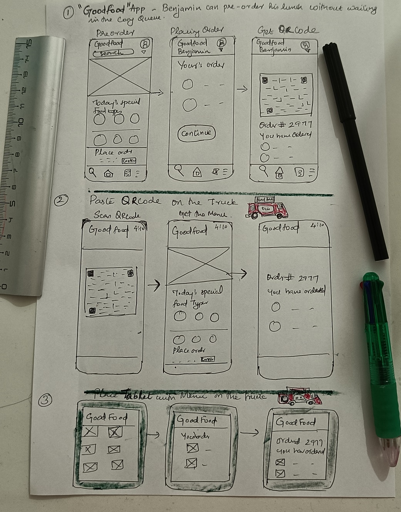

# UX-UI-Design
## Minju's Design (Team-1)

### This is my prototype trying to solve the MENU ACCESS problem regarding food trucks.

Solution:1 An app `GoodFood` helps Benjamin to pre-order the food without waiting in the long Queue.
---
Solution:2 A `QRcode` pasted at Truck helps Benjamin to order the food without downloading the app.
---
Solution:3 A `Tablet` kept on the truck helps Benjamin to view the menu and order the food if he doesn't have a mobile.
---

